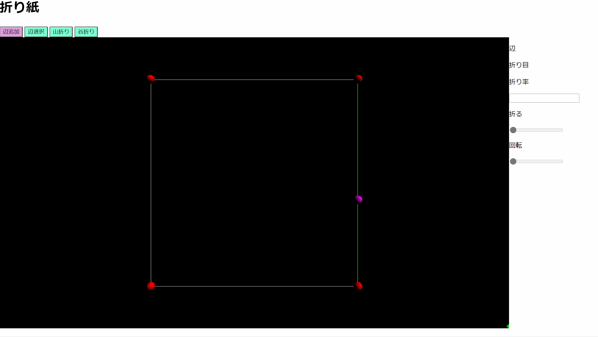

# 折り紙

https://soyukke.github.io/Origami/index.html



## 開発

### 準備
```sh
cd Origami
npm install
```

### webpack

```sh
npm run webpack 
```

## メモ
three.jsのインストール
```shell
$ npm install three
```

型定義パッケージ管理
```shell
$ npm install -g typings
```

three.jsの型定義インストール
```shell
$ typings init
$ typings install dt~three --save --global
```

フロントで実行するので，webpackを使ってjavascriptをまとめる．
```
$ npm i -D ts-loader
npm i -S three
npm install --save-dev webpack
npm install webpack-cli --save-dev
```

## TODO

## 初期表示
.---.
|   |
.---.

### 処理
- クリックでノード追加

### 表示
- ノードは球で表示．
- ガイドを表示する


## グラフ

### ノード

ノードが持つ情報
- 座標(x, y) 不要？
- ジオメトリ


### エッジ

- ノード1, ノード2

### グラフ描画

* [x] ノード追加時，ノードをsceneに追加
* [ ] ノード削除時，ノードをsceneから削除
* [x] エッジ追加時，エッジをsceneに追加
* [ ] エッジ削除時，エッジをsceneから削除
* [x] エッジとマウスカーソルとの距離計算実装
* [x] マウスカーソルともっとも距離が近いエッジを算出する
* [x] ノード追加モード: マウスカーソルともっとも近いエッジ上の点を表示する
* [ ] クリックでノード追加, ノード追加モード
* [x] ノード追加モード: クリックでノード追加, 前に追加したノードとつなぐエッジを追加
* [x] ノード追加モード: 同一ノードに2ノード追加はできない
* [ ] ノード選択モード: htmlにボタンを用意，ノード選択モードに変更する

## 折り

### 折り目の定義

* [ ] エッジに山折り, 谷折り, 折り%[0, 100]つまり[0, π]情報を設定する

### 折る

* [ ] 折り定義に従って折る

## 表示

* [ ] 辺を選択し，辺の情報を表示・編集できるようにする

## ファイル出力

* [ ] 展開図 画像?
* [ ] 折り紙json形式?

## ファイル入力

* [ ] 折り紙ファイルload


### エッジと点Pの距離
$\vec v_{ij}$はエッジをつなぐ頂点$j$から$i$へ向かうベクトル
頂点$j$から点pへ向かうベクトルを$\vec p$
$$
|\vec e_{i,j}||\vec p|\cos \theta = \vec e_{i, j} \cdot \vec p
$$

$$
\cos \theta = \frac{\vec e_{i, j} \cdot \vec p}{|\vec e_{i,j}||\vec p|}
$$

求める距離は
$$
d = \sin \theta |\vec p|.
$$

よって，
$$
\left(\frac{d}{|\vec p|}\right)^2 + \left(\frac{\vec e_{i, j} \cdot \vec p}{|\vec e_{i,j}||\vec p|}\right)^2 = 1
$$

$$
d = \sqrt{|\vec p|^2 - \left(\frac{\vec e_{i, j} \cdot \vec p}{|\vec e_{i,j}|}\right)^2}
$$
$$

